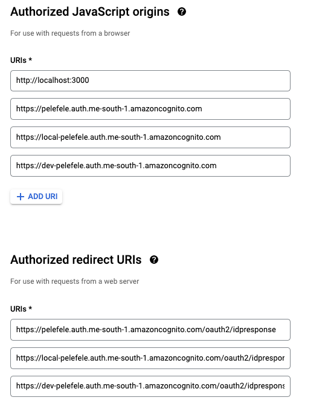

### Facebook Login setup

Create new test application using Facebook for developers platform.

Select 'Add Product' and select Facebook Login. 

Copy values from:

  

Login to AWS Secrets Manager->Store Secret

/account/api/secrets

Add keys

PROD_FACEBOOK_CLIENT_SECRET

DEV_FACEBOOK_CLIENT_SECRET

LOCAL_FACEBOOK_CLIENT_SECRET

PROD_FACEBOOK_CLIENT_ID

DEV_FACEBOOK_CLIENT_ID

LOCAL_FACEBOOK_CLIENT_ID

Set Website URL:

Copy domain name from AWS Cognito admin panel:

  

Add Website URL to App Domains under Basic->Settings->App Domains

### Google Login setup

Create new application:

  

Login to AWS Secrets Manager->Store Secret

/account/api/secrets

Add two keys

PROD_GOOGLE_CLIENT_SECRET

DEV_GOOGLE_CLIENT_SECRET

LOCAL_GOOGLE_CLIENT_SECRET

PROD_GOOGLE_CLIENT_ID

DEV_GOOGLE_CLIENT_ID

LOCAL_GOOGLE_CLIENT_ID

Copy domain prefix from AWS Cognito admin panel:

  

#### Cloudflare setup

Login to AWS Secrets Manager->Store Secret

/account/api/secrets

Add 3 keys

PROD_CLOUDFLARE_ACCOUNT_ID
DEV_CLOUDFLARE_ACCOUNT_ID
LOCAL_CLOUDFLARE_ACCOUNT_ID

PROD_CLOUDFLARE_ZONE_ID   
DEV_CLOUDFLARE_ZONE_ID
LOCAL_CLOUDFLARE_ZONE_ID

PROD_CLOUDFLARE_API_TOKEN
DEV_CLOUDFLARE_API_TOKEN
LOCAL_CLOUDFLARE_API_TOKEN

where account and one ids should be copied from Cloudflare admin interface.
Api token should be generated from 'worker template' with adjusted permissions and zone id.

Edit wrangler.toml and fill:

account_id=
zone_id=

replace *pelefele.com (old stokilo.com) domains mapping with your own:

name
routes

for dev and prod profiles. 

  
